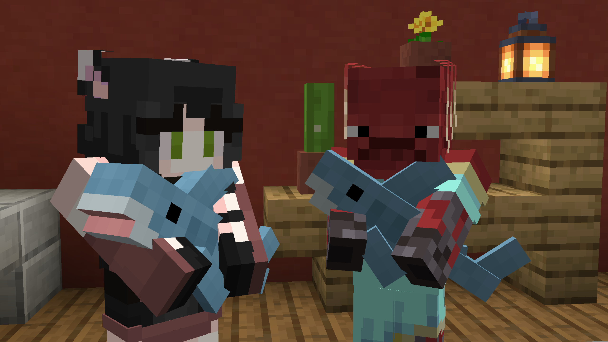
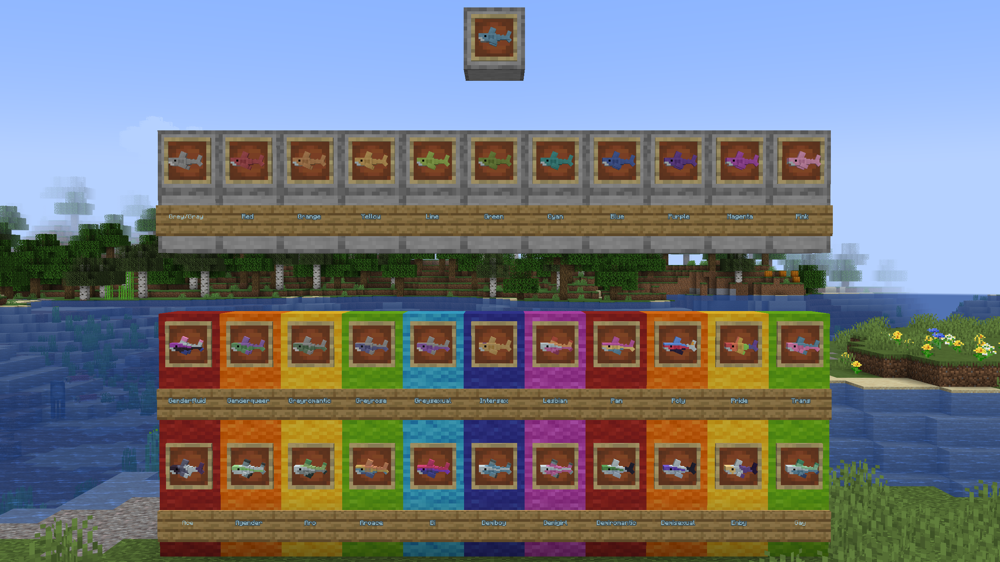

# Blåhaj of Undying

This is a client-side version of [Blåhaj](https://modrinth.com/mod/blahaj) by Hibi. This version replaces the totem of undying model and name instead of creating a new item for our beloved Blåhaj, who you can now cuddle even on vanilla servers!

## Content

Only the Blåhaj itself exists in this version, replacing the vanilla totem of undying.
There are however 34 pride and color based texture variants available which 
can be accessed by renaming your Blåhaj in an anvil!

Below is an ingame display of all available shark textures:

You can change your variant of choice by putting the 
word on the sign below it anywhere in the name of your item.
(You may have to zoom in on the image to see the keywords)

For example, these would all be valid:

- `Red Shark`
- `Trans Shark`
- `trans shark`
- `This creature is bi`
- `there are many words in this item name but here's GAY so its valid`

## Why is this not a resource pack?

Because resource packs cant recreate the cuddly arms animation. 
Additionally, changing a texture based on item name in this 
particular way is not possible in either vanilla or CITResewn.

## License

Like the original, this mod is licensed under the [Unlicense](./LICENSE). Feel free to learn from it and incorporate it in your own projects.

The pride variants of the Blåhaj have been adapted from [Blåhaj Beyond](https://modrinth.com/mod/blahaj-beyond) by [IThundxr](https://github.com/IThundxr), and are licensed under LGPL-2.

The Biscuit and other character plushies were created by [Crephan](https://twitter.com/Crephann).

The icon of this project is the Blobhaj by Heatherhorns, and is licensed under a [Creative Commons Attribution 4.0 International License](http://creativecommons.org/licenses/by/4.0/).
