# Keywords

This page contains all current plushies provided by Blåhaj of Undying. 
Click on the plush to see a list of keywords you can use to get it.

    

        <a href="#normal">
            
            Shark
        </a>
    

    

        <a href="#whale">
            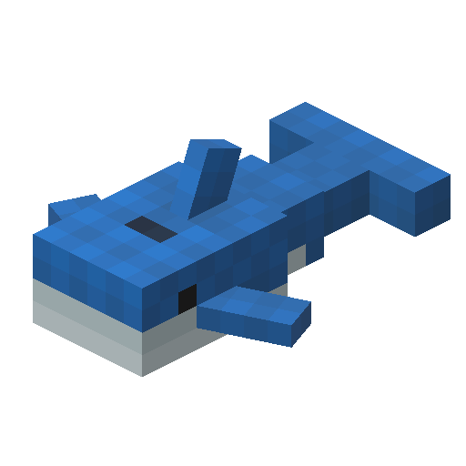
            Whale
        </a>
    

    

        <a href="#grey">
            
            Grey
        </a>
    

    

        <a href="#red">
            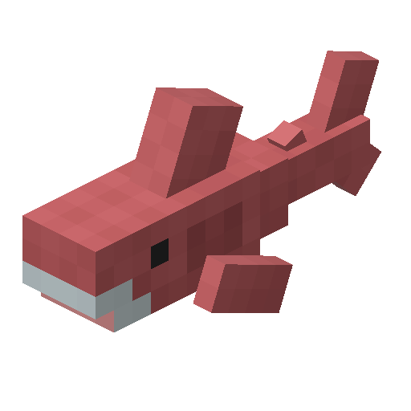
            Red
        </a>
    

    

        <a href="#orange">
            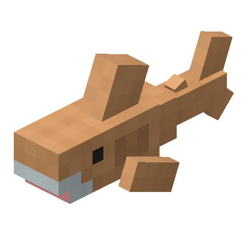
            Orange
        </a>
    

    

        <a href="#yellow">
            
            Yellow
        </a>
    

    

        <a href="#lime">
            
            Lime
        </a>
    

    

        <a href="#green">
            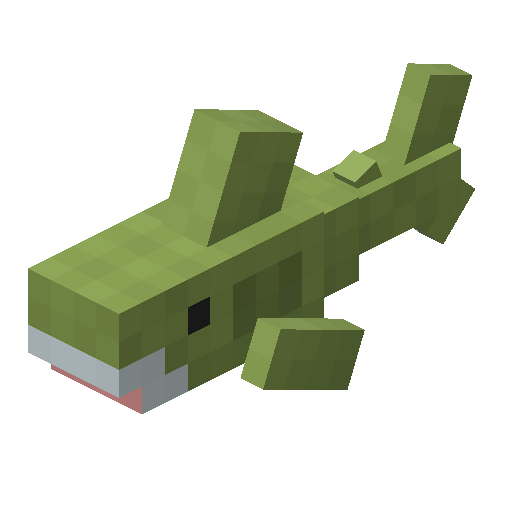
            Green
        </a>
    

    

        <a href="#cyan">
            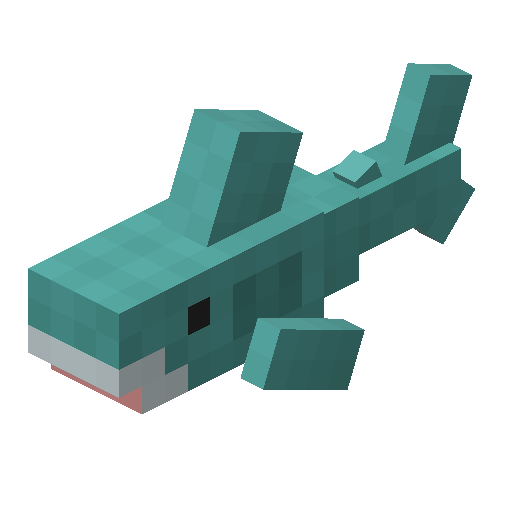
            Cyan
        </a>
    
   
    

        <a href="#blue">
            
            Blue
        </a>
    

    

        <a href="#purple">
            
            Purple
        </a>
    

    

        <a href="#magenta">
            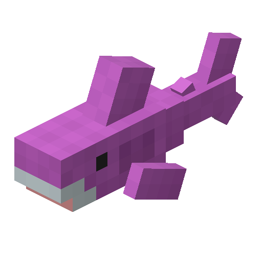
            Magenta
        </a>
    
    
    

        <a href="#pink">
            
            Pink
        </a>
    
    
    

        <a href="#ace">
            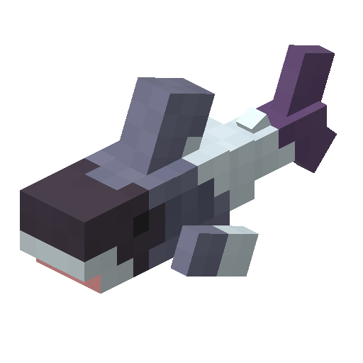
            Ace
        </a>
    
    
    

        <a href="#agender">
            
            Agender
        </a>
    

    

        <a href="#aro">
            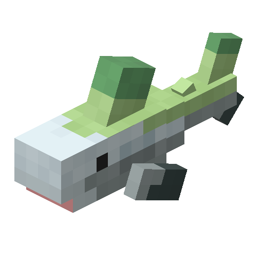
            Aro
        </a>
    

    

        <a href="#aroace">
            
            Aroace
        </a>
    

    

        <a href="#bi">
            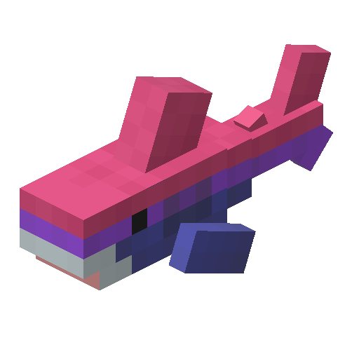
            Bi
        </a>
    

    

        <a href="#demiboy">
            
            Demiboy
        </a>
    

    

        <a href="#demigirl">
            
            Demigirl
        </a>
    

    

        <a href="#demiromantic">
            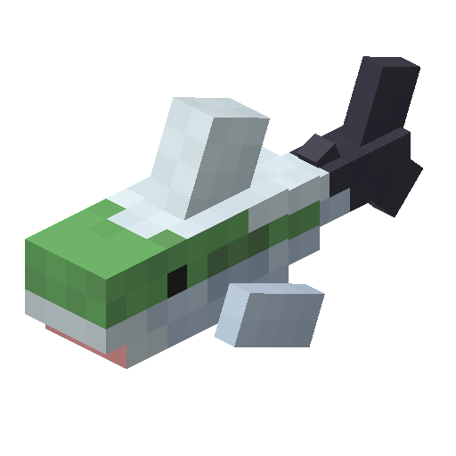
            Demiromantic
        </a>
    

    

        <a href="#demisexual">
            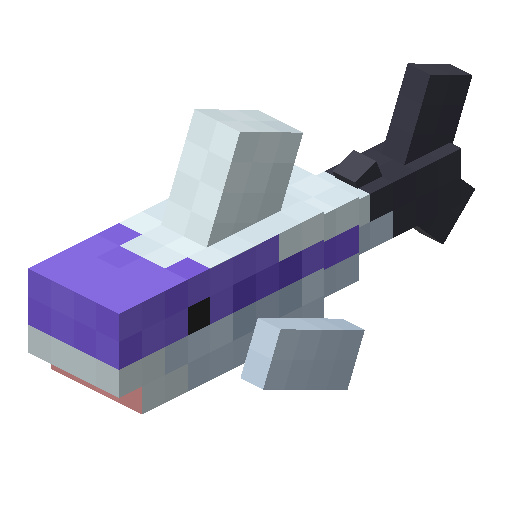
            Demisexual
        </a>
    

    

        <a href="#enby">
            
            Enby
        </a>
    

    

        <a href="#gay">
            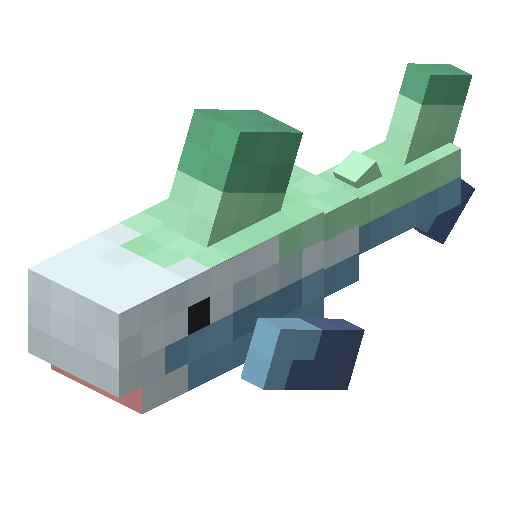
            Gay
        </a>
    

    

        <a href="#genderfluid">
            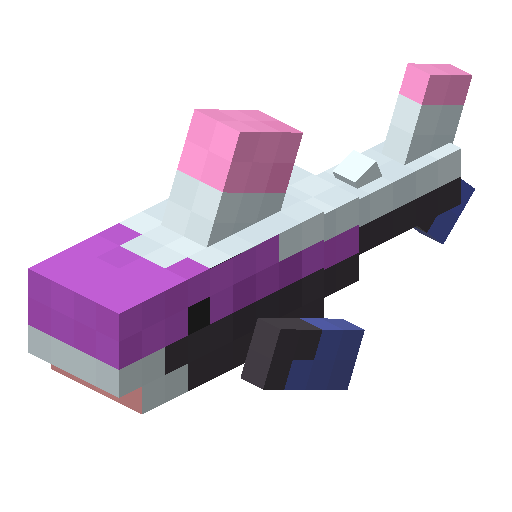
            Genderfluid
        </a>
    

    

        <a href="#genderqueer">
            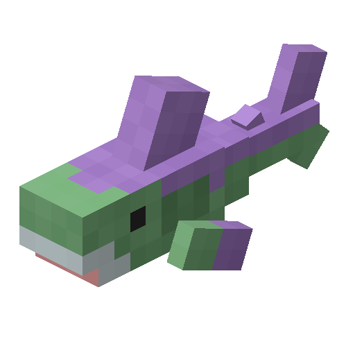
            Genderqueer
        </a>
    

    

        <a href="#greyromantic">
            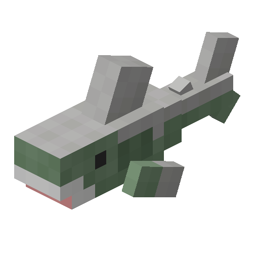
            Greyromantic
        </a>
    

    

        <a href="#greyrose">
            
            Greyrose
        </a>
    

    

        <a href="#greysexual">
            
            Greysexual
        </a>
    

    

        <a href="#intersex">
            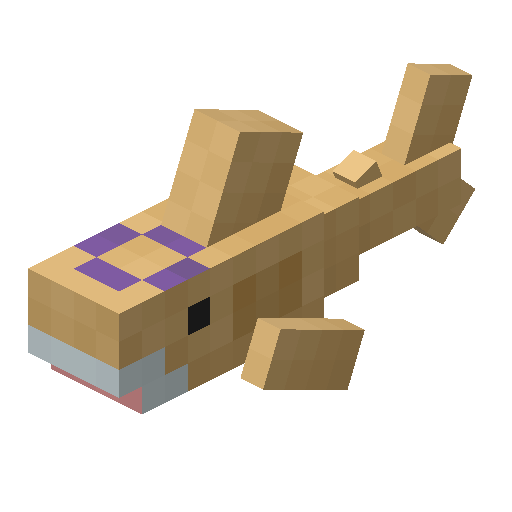
            Intersex
        </a>
    

    

        <a href="#lesbian">
            
            Lesbian
        </a>
    

    

        <a href="#pan">
            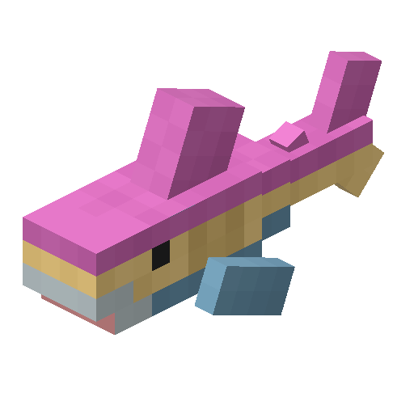
            Pan
        </a>
    

    

        <a href="#poly">
            
            Poly
        </a>
    

    

        <a href="#pride">
            
            Pride
        </a>
    

    

        <a href="#prider">
            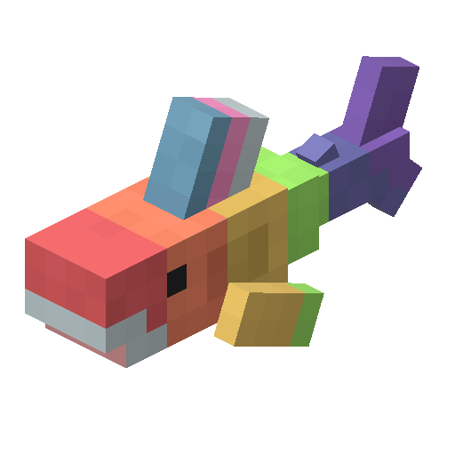
            Prider
        </a>
    

    

        <a href="#trans">
            
            Trans
        </a>
    
    
    

        <a href="#bridget">
            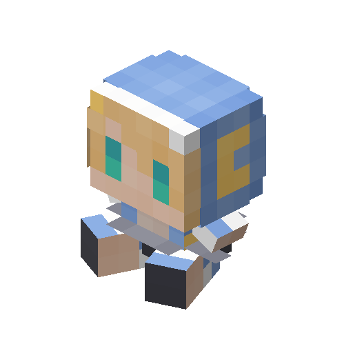
            Bridget
        </a>
    

    

        <a href="#astolfo-bean">
            
            Astolfo Bean
        </a>
    

    

        <a href="#mahiro">
            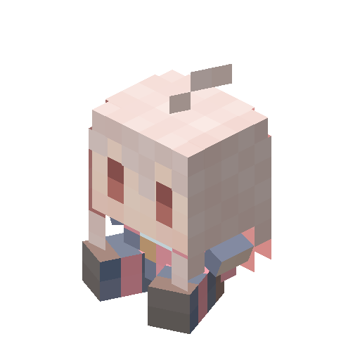
            Mahiro
        </a>
    

    

        <a href="#lazy-mahiro">
            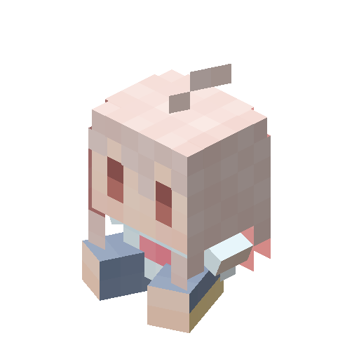
            Lazy Mahiro
        </a>
    

# Variants

## Normal

Keywords: `shark`, `blahaj`, `blåhaj`, `shork`, 
`shonk`, `sharky`, `sharkie`, `haj`, `haai`, `hai`,
`biter`, `chomper`, `chompy`, `muncher`, `megalodon`,
`meg`, `meggy`, `gawr`, `finn`

## Whale

Keywords: `whale`, `blavingad`, `blåvingad`

## Grey

Keywords: `gray`, `grey`

## Red

Keywords: `red`

## Orange

Keywords: `orange`

## Yellow

Keywords: `yellow`

## Lime

Keywords: `lime`

## Green

Keywords: `green`

## Cyan

Keywords: `cyan`

## Blue

Keywords: `blue`

## Purple

Keywords: `purple`

## Magenta

Keywords: `magenta`

## Pink

Keywords: `pink`

## Ace

Keywords: `ace`

## Agender

Keywords: `agender`

## Aro

Keywords: `aro`

## Aroace

Keywords: `aroace`

## Bi

Keywords: `bi`

## Demiboy

Keywords: `demiboy`

## Demigirl

Keywords: `demigirl`

## Demiromantic

Keywords: `demiromantic`

## Demisexual

Keywords: `demisexual`

## Enby

Keywords: `enby`

## Gay

Keywords: `gay`

## Genderfluid

Keywords: `genderfluid`

## Genderqueer

Keywords: `genderqueer`

## Greyromantic

Keywords: `greyromantic`

## Greyrose

Keywords: `greyrose`

## Greysexual

Keywords: `greysexual`

## Intersex

Keywords: `intersex`

## Lesbian

Keywords: `lesbian`

## Pan

Keywords: `pan`

## Poly

Keywords: `poly`

## Pride

Keywords: `pride`

## Prider

Keywords: `prider`

## Trans

Keywords: `trans`

## Bridget

Keywords: `bridget`, `biscuit`, `basket`, `bucket`, `baguette`, `bridge`,
`budget`, `brisket`, `bidet`, `brexit`, `bracket`, `brigade`, `bingus`,
`blanket`

## Astolfo Bean

Keywords: `astolfo bean`, `bean`

## Mahiro

Keywords: `mahiro`

## Lazy Mahiro

Keywords: `lazy-mahiro`
